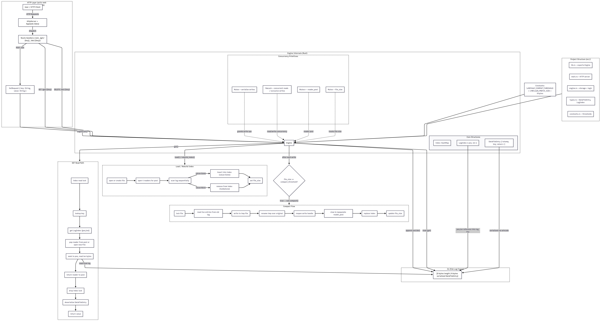

# breakout1-kv-store

A log-structured key-value store written in Rust, inspired by the Bitcask storage model. All writes are appended to a log file on disk. An in-memory hash index maps each key to its position and length in the log, making reads a single seek. Compaction rewrites the log keeping only the latest value per key, dropping stale entries and tombstones.

## User Stories

- As a user, I want to create a database instance
- As a user, I want to create records in the database
- As a user, I want to read records in the database
- As a user, I want to update records in the database
- As a user, I want to delete records from the database
- As a user, I want to save the database to disk
- As a user, I want to restore the database from disk

## Architecture Diagram



```
user
 |
 v
Engine
 |-- file: append-only log (Mutex<File>)
 |-- index: in-memory HashMap key -> LogIndex { pos, len } (RwLock)
 |-- reader_pool: pooled read-only file handles (Mutex<Vec<File>>)
 |-- file_size: tracked incrementally, triggers auto-compaction
```

### On-disk format

Each record is written as:

```
[8 bytes: entry length as u64 LE][N bytes: wincode-serialized DataFileEntry]
```

`DataFileEntry` holds a timestamp, the key, and an optional value. A `None` value is a tombstone marking a deleted key.

## Operations

| Operation | Description |
|---|---|
| `load(path)` | Open an existing log and rebuild the index, or create a new file |
| `load_with_threshold(path, bytes)` | Same as load but with a custom compaction threshold |
| `set(key, value)` | Append a new entry and update the index |
| `get(key)` | Look up the index and read the value from disk |
| `del(key)` | Append a tombstone and remove the key from the index |
| `compact()` | Rewrite the log keeping only live entries, shrink the file |

Auto-compaction fires inside `set` whenever the log file exceeds the threshold (default 1 MB).

## Concurrency

Reads and writes are safe to call from multiple threads. The engine wraps the write file handle in a `Mutex` and the index in an `RwLock`, allowing concurrent reads while serializing writes. The read path holds the index read lock across the full operation (index lookup, file handle acquisition, I/O, and handle return) to prevent a race with compaction swapping the underlying file.

## HTTP API

The server runs on `http://127.0.0.1:8080`. All keys and values are plain strings.

| Method | Path | Body | Description |
|---|---|---|---|
| `GET` | `/` | | Health check |
| `POST` | `/set` | `{"key": "k", "value": "v"}` | Store a key-value pair |
| `GET` | `/get/{key}` | | Retrieve a value by key |
| `DELETE` | `/del/{key}` | | Delete a key |

### Examples

```bash
# set
curl -X POST http://127.0.0.1:8080/set \
  -H "Content-Type: application/json" \
  -d '{"key": "hello", "value": "world"}'

# get
curl http://127.0.0.1:8080/get/hello

# delete
curl -X DELETE http://127.0.0.1:8080/del/hello
```

### Responses

| Status | Meaning |
|---|---|
| `200 OK` | Success, body contains the value (get) or `OK` (set/del) |
| `404 Not Found` | Key does not exist (get only) |
| `500 Internal Server Error` | Storage error |

## Project Structure

```
src/
  lib.rs          - crate root, module declarations
  main.rs         - actix-web HTTP server
  engine.rs       - Engine struct, all storage logic
  types.rs        - DataFileEntry, LogIndex
  constants.rs    - DEFAULT_COMPACT_THRESHOLD, LEN_PREFIX_SIZE

tests/
  engine.rs       - integration tests (CRUD, persistence, compaction, concurrency)
```

## Getting Started

```bash
# build
make build

# run
make run

# test
make test

# clippy
make check

# clean
make clean

# format (requires nightly toolchain)
make fmt
```

## Dependencies

- [actix-web](https://crates.io/crates/actix-web) - HTTP server framework
- [wincode](https://github.com/anza-xyz/wincode) - fast, bincode-compatible serialization
- [tempfile](https://crates.io/crates/tempfile) - temporary files for tests
